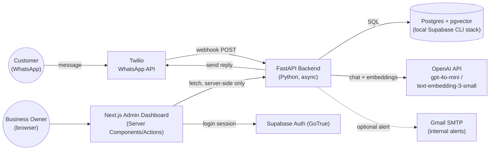
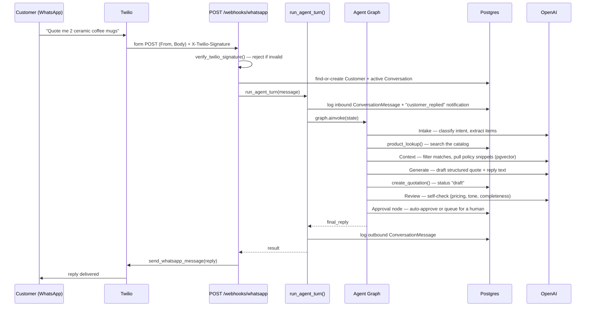
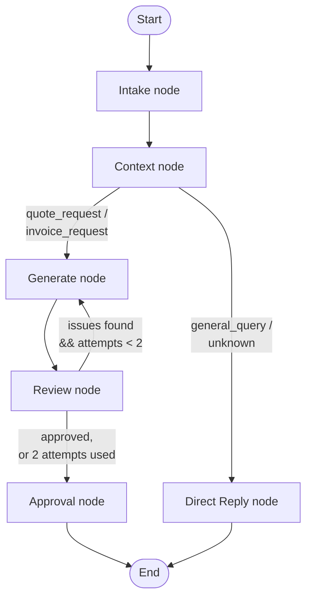
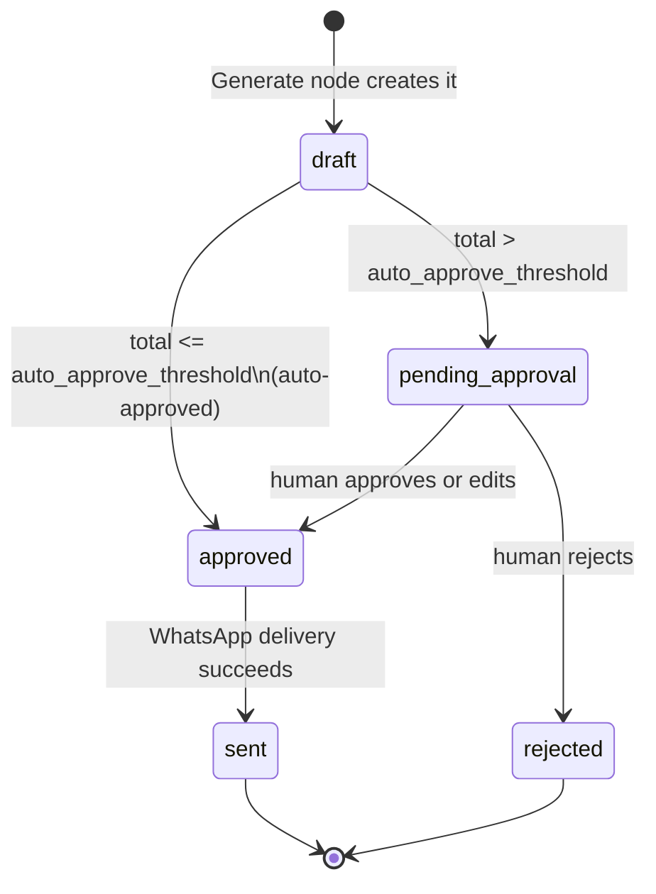
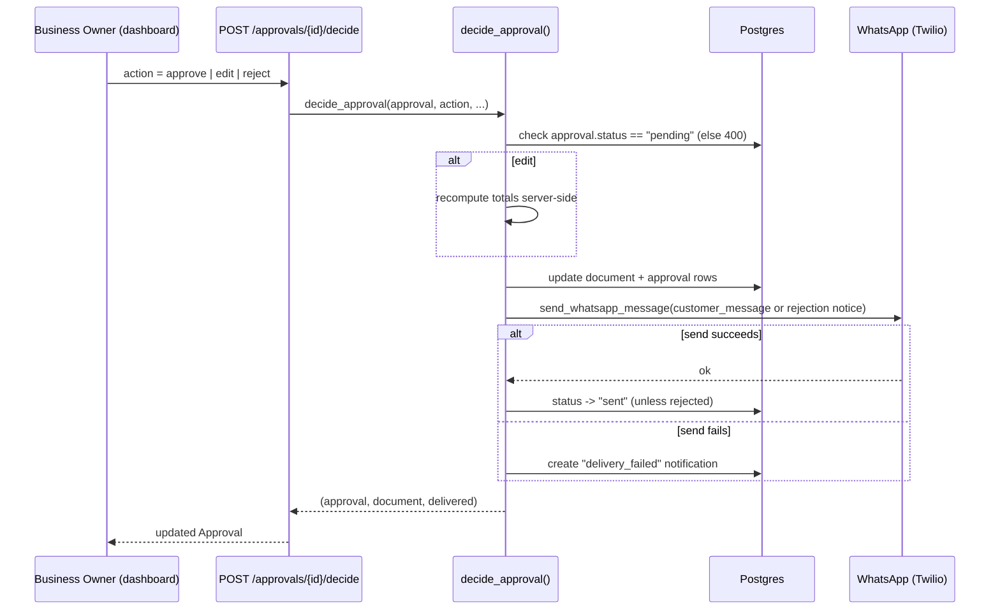
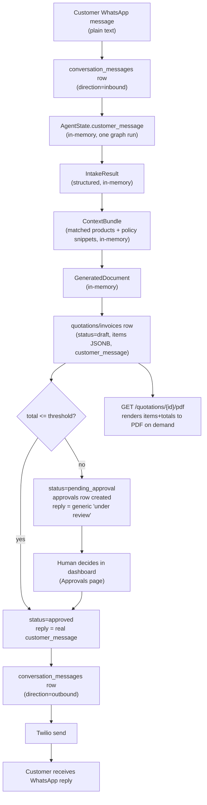
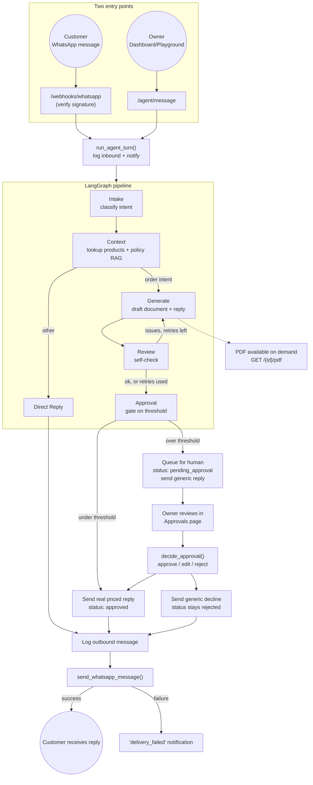

# EnterpriseFlow — Complete Project Documentation

*A from-zero, step-by-step guide to what this project is, how it's built, and why.*

## How to read this document

This document assumes you know **nothing** about EnterpriseFlow. It builds up gradually: general concepts before specific code, "what" before "how," and every technical term is defined the first time it's used. Each major section ends with a **Key Takeaways** box — if you're skimming, those boxes alone will keep you oriented.

If you want to jump around anyway, here's the map:

1. [What Is EnterpriseFlow, and Why Does It Exist?](#1-what-is-enterpriseflow-and-why-does-it-exist)
2. [The Big Picture: How the Pieces Fit Together](#2-the-big-picture-how-the-pieces-fit-together)
3. [A Guided Tour of the Codebase](#3-a-guided-tour-of-the-codebase)
4. [Core Concepts You Need Before Going Further](#4-core-concepts-you-need-before-going-further)
5. [Step-by-Step: The Life of One Customer Message](#5-step-by-step-the-life-of-one-customer-message)
6. [Deep Dive: The Multi-Agent Pipeline (LangGraph)](#6-deep-dive-the-multi-agent-pipeline-langgraph)
7. [Deep Dive: Data & Storage Layer](#7-deep-dive-data--storage-layer)
8. [Deep Dive: The API Layer (FastAPI Routes)](#8-deep-dive-the-api-layer-fastapi-routes)
9. [Deep Dive: The Human Approval Workflow](#9-deep-dive-the-human-approval-workflow)
10. [Deep Dive: WhatsApp Integration](#10-deep-dive-whatsapp-integration)
11. [Deep Dive: PDFs, Email Alerts, and Follow-Ups](#11-deep-dive-pdfs-email-alerts-and-follow-ups)
12. [Deep Dive: The Admin Dashboard (Next.js Frontend)](#12-deep-dive-the-admin-dashboard-nextjs-frontend)
13. [How Data Flows: Input to Output](#13-how-data-flows-input-to-output)
14. [Why We Built It This Way: Key Design Decisions](#14-why-we-built-it-this-way-key-design-decisions)
15. [Dependencies: What We Use and Why](#15-dependencies-what-we-use-and-why)
16. [Common Pitfalls, Edge Cases & Debugging Tips](#16-common-pitfalls-edge-cases--debugging-tips)
17. [Testing & Verifying the System](#17-testing--verifying-the-system)
18. [Deployment: Where This Runs](#18-deployment-where-this-runs)
19. [Putting It All Together: The Full Execution Flow](#19-putting-it-all-together-the-full-execution-flow)
20. [Glossary](#20-glossary)

---

## 1. What Is EnterpriseFlow, and Why Does It Exist?

Imagine you run a small business — say, a shop selling mugs, pillows, and home electronics. Customers message you on WhatsApp all day: *"Do you have blue throw pillows? How much for 20?"* Answering each one means checking your price list, doing GST (India's Goods and Services Tax) math by hand, typing a reply, and — if the order is big — asking your manager before confirming anything. It's slow, repetitive, and error-prone.

**EnterpriseFlow automates that whole loop**, except for the one part that legally and practically needs a human: approving anything expensive before it goes out. Think of it as hiring a tireless new employee who:

- Reads every incoming WhatsApp message instantly.
- Figures out whether the customer wants a price quote, wants to actually order (an invoice), or just has a question.
- Looks up real products and real prices from your catalog — never guesses or invents them.
- Writes up a proper quotation or invoice, in plain, friendly language.
- **Automatically sends small orders**, but **pauses and asks you first** for anything above a threshold you set.
- Generates a proper PDF, keeps a record of every conversation, and pings you (in-app and by email) whenever something needs your attention.

This is a **single-tenant** system, meaning one deployment serves exactly one business — there's no "Company A vs Company B" separation to worry about, no user roles beyond a single admin login. That's a deliberate simplicity choice, not a missing feature (see [Section 14](#14-why-we-built-it-this-way-key-design-decisions)).

### The three jobs this system does

| Job | In plain English |
|---|---|
| **Customer query handling** | Read a WhatsApp message, understand what's wanted, reply sensibly. |
| **Quotation / invoice generation** | Turn "what's wanted" into a priced, structured document with real catalog data. |
| **Human-approved delivery** | Never let a priced document reach the customer without a person checking it, if it's above a value threshold. |

> **Key Takeaways**
> - EnterpriseFlow is a WhatsApp-facing AI assistant for a small business that quotes, invoices, and delivers — with a mandatory human checkpoint for anything expensive.
> - It's single-tenant: one deployment, one business, one admin.
> - Everything downstream in this document exists to serve those three jobs.

---

## 2. The Big Picture: How the Pieces Fit Together

Before looking at any code, it helps to see the shape of the whole system — like looking at a map before walking the streets.

There are two "front doors" into the system:

1. **A customer, texting on WhatsApp.**
2. **The business owner, using a web dashboard in a browser.**

Both doors lead into the same **backend** (the "brain" of the operation), which talks to a **database** (where everything is remembered) and to **OpenAI** (for the actual language understanding/generation). The backend also talks outward to **Twilio** (to send/receive WhatsApp messages) and, optionally, **Gmail** (to email the owner an alert).



A few things worth noticing immediately, because they explain a lot of later design choices:

- **The browser never talks to the backend directly** (except for one exception: clicking a link to download a PDF). Every dashboard page fetches its data *on the server*, inside Next.js. That means there's no CORS (Cross-Origin Resource Sharing — the browser-security handshake needed when a webpage's JavaScript calls a different domain) to configure, because the "calling" happens server-to-server, not browser-to-server.
- **The database isn't just a place to store rows** — it also does *semantic search* via an extension called `pgvector` (more on this in [Section 6](#6-deep-dive-the-multi-agent-pipeline-langgraph)), which lets the system find company-policy text that's *conceptually* relevant to a question, not just keyword-matching.
- **Twilio and Gmail are both optional at boot.** The backend is written so it starts up fine with blank credentials for either — they just quietly no-op (Gmail) or fail safely (Twilio, more on "failing closed" in [Section 10](#10-deep-dive-whatsapp-integration)) until real credentials are added.

### Why a multi-agent pipeline instead of "just ask ChatGPT"?

You could imagine building this by sending the whole customer message to one big AI prompt and hoping for the best. EnterpriseFlow instead breaks the work into a **pipeline of five specialized agents**, each with one job, passing structured data to the next — much like an assembly line, or like a request moving through different desks in an office (intake clerk → research assistant → drafter → proofreader → approvals manager). We introduce this pipeline properly in [Section 6](#6-deep-dive-the-multi-agent-pipeline-langgraph); for now, just know it sits *inside* the "FastAPI Backend" box above.

> **Key Takeaways**
> - Two entry points (WhatsApp customers, dashboard owner) funnel into one backend.
> - The backend is the only thing that talks to the database, OpenAI, Twilio, and Gmail — the frontend never does directly.
> - The "brain" work (understanding a message, pricing it, drafting a reply) is broken into a chain of small, specialized AI agents rather than one big prompt.

---

## 3. A Guided Tour of the Codebase

Now that you know the shape of the system, let's walk through where everything actually lives on disk. Think of this section as a table of contents for the repository itself.

```
EnterpriseFlow/
├── backend/         → the FastAPI Python service: the "brain"
├── frontend/        → the Next.js dashboard: the "control room"
├── supabase/        → database schema definitions (migrations) + local dev config
├── .github/         → CI (automated test/build checks on every push)
├── docs/            → a demo walkthrough script
├── scripts/         → convenience scripts to run both apps locally
├── render.yaml       → tells Render (a hosting provider) how to deploy the backend
├── DEPLOYMENT.md     → the deployment checklist for whoever ships this to production
├── PLAN.md           → the long-term roadmap, phase by phase
└── STATE.md          → short-lived "what was I doing" notes between work sessions
```

### 3.1 `backend/` — the brain

```
backend/
├── app/
│   ├── main.py              → creates the FastAPI app, plugs in every router
│   ├── core/
│   │   ├── config.py        → all configuration (API keys, thresholds) in one typed object
│   │   └── db.py            → database connection setup
│   ├── models/
│   │   ├── orm.py           → the database tables, described as Python classes
│   │   └── schemas.py       → the shapes of API requests/responses
│   ├── repositories/        → one "librarian" class per table, for reading/writing rows
│   ├── services/            → business logic that isn't part of the AI pipeline itself
│   │   (PDF generation, WhatsApp sending, email alerts, policy-doc ingestion,
│   │    the approval decision workflow, staff follow-ups)
│   ├── agents/               → the LangGraph multi-agent AI pipeline (the heart of the system)
│   │   (state, graph wiring, node logic, tools, prompts, structured-output schemas, an eval harness)
│   └── api/
│       ├── deps.py           → shared FastAPI dependency (a database session per request)
│       └── routes/           → one file per group of HTTP endpoints
├── tests/test_e2e.py         → end-to-end tests covering the whole pipeline
├── scripts/seed_products.py  → loads a sample 500-row product catalog into the database
├── requirements.txt          → Python dependencies
└── Dockerfile                → how to package the backend as a container for deployment
```

### 3.2 `frontend/` — the control room

```
frontend/
├── src/
│   ├── proxy.ts              → Next.js 16's version of "middleware": redirects signed-out visitors to /login
│   ├── lib/
│   │   ├── api.ts             → one typed function per backend endpoint the dashboard calls
│   │   ├── format.ts          → money/date formatting helpers
│   │   ├── motion.ts          → shared animation presets
│   │   └── supabase/          → browser/server Supabase clients (for login sessions)
│   ├── components/
│   │   ├── ui/                → reusable design-system pieces (Button, Card, Table, Badge, ...)
│   │   ├── Sidebar.tsx, NotificationBell.tsx, ApprovalCard.tsx, PlaygroundChat.tsx, FollowUpSearch.tsx
│   └── app/
│       ├── globals.css        → design tokens (colors, type scale, shadows) as a Tailwind theme
│       ├── layout.tsx          → loads fonts, wraps the whole app
│       ├── login/              → the sign-in page
│       └── (dashboard)/         → every page behind login: Overview, Inbox, Approvals, Quotations,
│           Invoices, Products, Analytics, Settings, Playground, Follow-ups
└── package.json
```

### 3.3 `supabase/migrations/` — the database's own history

Each file here is a small, numbered SQL script that changes the database schema. They run **in filename order**, oldest first, and each one only ever adds to what came before — nobody edits an old migration file once it's been applied anywhere. Think of it like a lab notebook: you don't erase yesterday's entry to fix today's mistake, you write a new entry. We'll look at what each migration actually contains in [Section 7](#7-deep-dive-data--storage-layer).

> **Key Takeaways**
> - `backend/app/agents/` is the most important folder in the whole repository — it's the AI decision-making pipeline.
> - `backend/app/services/` holds "plumbing" logic (PDFs, WhatsApp, email) that supports the pipeline but isn't itself AI reasoning.
> - The frontend's `app/(dashboard)/` folder has one sub-folder per page a logged-in owner can visit.
> - Database changes are a linear, append-only sequence of migration files, not edits to a single schema file.

---

## 4. Core Concepts You Need Before Going Further

A handful of ideas show up over and over in this codebase. If you're comfortable with all of these, the rest of the document will read quickly. If any are new, read this section slowly — everything after it assumes you know these.

| Concept | Plain-English definition | Analogy |
|---|---|---|
| **FastAPI** | A Python web framework for building HTTP APIs (endpoints a program can call over the network, returning JSON). | The reception desk of an office — it receives requests and routes them to the right department. |
| **`async`/`await`** | A way of writing code that can pause on slow operations (like a database query or an API call) *without* blocking everything else. | A waiter who takes an order, puts it in to the kitchen, and serves other tables while it cooks — instead of standing at the kitchen window doing nothing. |
| **Pydantic model** | A Python class that defines exactly what fields a piece of data must have, and validates it automatically. | A form with labeled boxes — you can't submit it with a box left in the wrong shape. |
| **SQLAlchemy ORM** | A library that lets you describe database tables as Python classes, and query them with Python instead of hand-written SQL. | A translator standing between your Python code and the database's native language (SQL). |
| **Repository pattern** | Wrapping "read/write this table" logic in one dedicated class per table, instead of scattering raw queries everywhere. | A librarian for each section of the library — you ask the librarian, you don't rummage the shelves yourself. |
| **LangGraph** | A library for wiring multiple AI "steps" (nodes) together into a flowchart, with shared state passed between them. | A flowchart of desks in an office, where a folder (the state) gets passed from desk to desk, sometimes bouncing back for revision. |
| **Structured output** | Asking an LLM (Large Language Model, e.g. GPT-4o-mini) to return data that matches an exact schema (like a Pydantic model), not free-form text. | Instead of asking someone to "describe the order," handing them a form to fill in — you get consistent fields back every time. |
| **Embeddings / RAG** | Converting text into a list of numbers (a "vector") that captures its *meaning*, so you can find conceptually similar text later — this pattern is called **Retrieval-Augmented Generation**. | A librarian who can find you a book by describing the plot, not just by the exact title. |
| **pgvector** | A Postgres extension that lets the database store those number-vectors and search by "how similar is this meaning" instead of only exact/partial text match. | Giving the library's card catalog a "similar books" button. |
| **Server Component / Server Action (Next.js)** | Code that runs *only on the server*, never shipped to the browser — used here for every backend call, so API keys and internal URLs never reach the client. | A hotel concierge who calls the restaurant for you, rather than handing you the restaurant's private phone line. |
| **Webhook** | A URL that an external service (Twilio) calls automatically when something happens (a WhatsApp message arrives), instead of you having to constantly ask "did anything happen yet?". | A doorbell, instead of checking the front door every five minutes. |
| **HMAC signature verification** | A cryptographic check proving a request really came from who it claims to (here, Twilio), using a shared secret both sides know. | A wax seal on a letter — you can tell if it's genuinely from the sender because only they have the seal. |

> **Key Takeaways**
> - `async` lets the backend juggle many requests without one slow database call freezing everything else.
> - Pydantic + structured output is how the system forces the AI to hand back well-shaped, checkable data instead of unpredictable prose.
> - pgvector/embeddings is what lets the system search *policy documents* by meaning, not just keyword.
> - Every dashboard-to-backend call happens in server-side Next.js code, which is why there's no browser-facing API surface to secure with CORS.

---

## 5. Step-by-Step: The Life of One Customer Message

This is the single most useful mental model in the whole project. Once you understand this one journey, every file in `backend/app/agents/` and `backend/app/services/` will make sense as "which step of this journey does this file implement?"

Let's trace a real example: a customer texts **"Quote me 2 ceramic coffee mugs"** on WhatsApp.



Walking through each step in plain language:

1. **The message arrives at Twilio**, which is a service that runs WhatsApp Business messaging for us. Twilio turns that into an HTTP `POST` request to our backend's webhook URL: `POST /webhooks/whatsapp` (`backend/app/api/routes/whatsapp.py:29`).
2. **We verify it's really from Twilio.** Twilio signs every webhook request with a secret only we and Twilio know (`verify_twilio_signature`, `backend/app/services/whatsapp.py:34`). If the signature doesn't check out, we reject with a 403 — no exceptions. (If `TWILIO_AUTH_TOKEN` is blank, *every* signature fails this check — a deliberate "fail closed" default; see [Section 16](#16-common-pitfalls-edge-cases--debugging-tips).)
3. **We find or create the customer and conversation.** Every WhatsApp number becomes a `Customer` row; if there's already an open `Conversation` for them, we reuse it, otherwise we start a new one.
4. **`run_agent_turn()` takes over** (`backend/app/agents/runner.py:16`). This one function is deliberately shared between the WhatsApp webhook *and* the dashboard's "Agent Playground" and `POST /agent/message` endpoint, so both entry points behave identically — there's exactly one place that defines "what happens when a customer message comes in."
5. **The message is logged**, and an internal `customer_replied` notification is raised (so the dashboard's notification bell lights up).
6. **The LangGraph agent graph runs** — this is the five-agent pipeline: Intake → Context → Generate → Review → Approval. We dedicate the entirety of [Section 6](#6-deep-dive-the-multi-agent-pipeline-langgraph) to this, since it's the core of the product.
7. **The graph returns a `final_reply` string.** That gets logged as an outbound message and sent back through Twilio to the customer.

Notice something important: at no point does the system send a document's real, priced text to the customer *unless* either (a) the order is small enough to auto-approve, or (b) a human has explicitly approved it. That gate is enforced inside step 6, and we dedicate [Section 9](#9-deep-dive-the-human-approval-workflow) to exactly how.

> **Key Takeaways**
> - `run_agent_turn()` is the single shared entry point for "a message came in, do something about it" — used by WhatsApp *and* the dashboard's test playground.
> - Every inbound and outbound message is logged to `conversation_messages`, which is what powers the Inbox view in the dashboard.
> - The AI pipeline (step 6) is where the actual "understanding and drafting" work happens — everything before and after it is plumbing (auth, logging, delivery).

---

## 6. Deep Dive: The Multi-Agent Pipeline (LangGraph)

This is the heart of EnterpriseFlow, living in `backend/app/agents/`. Instead of one AI call trying to do everything, the work is split across five **nodes** — small, focused steps, each with one clear job — wired together into a graph (a flowchart) that a library called **LangGraph** knows how to run.

### 6.1 The shared "folder": `state.py`

Every node in the graph reads from and writes to one shared object, called the **state**. Think of it as a manila folder that gets passed from desk to desk — each desk adds a new document to the folder, and later desks can read anything earlier desks added.

```python
# backend/app/agents/state.py
class AgentState(TypedDict, total=False):
    conversation_id: uuid.UUID
    customer_id: uuid.UUID
    customer_message: str

    intake: IntakeResult
    context: ContextBundle
    document: GeneratedDocument
    document_id: uuid.UUID
    review: ReviewResult
    review_attempts: int
    approval: ApprovalDecision

    final_reply: str
```

`TypedDict` here just means "a dictionary, but Python (and your editor) knows what keys/types are allowed." `total=False` means not every key has to be present yet — early in the graph's run, only `customer_message` exists; by the end, all of them do.

### 6.2 The flowchart itself: `graph.py`



Two routing decisions drive the shape of this graph, both defined as small Python functions in `graph.py`:

- **`route_after_context`**: if the customer's intent (decided by Intake) is `quote_request` or `invoice_request`, go generate a document; otherwise (a general question, or something unclear), skip straight to a plain conversational reply.
- **`route_after_review`**: if the Review agent found no issues, *or* we've already tried generating twice (`MAX_REVIEW_ATTEMPTS = 2`), move on to Approval. Otherwise, loop back to Generate with the Review agent's feedback, so it gets a second try.

That loop — Generate ⟲ Review — is the system's built-in self-correction mechanism. Rather than trusting the first draft, a *second* AI pass specifically checks the first one's work before anything gets queued for a human or sent to a customer, and can send it back for a redo with concrete feedback.

### 6.3 The five nodes: `nodes.py`

Each node is an `async` Python function. Here's what each one actually does, in order:

**Intake** (`intake_node`) — reads the raw customer message and classifies it:
- `intent`: one of `quote_request`, `invoice_request`, `general_query`, `unknown`.
- `requested_items`: the products mentioned, in the customer's own words (deliberately *not* matched to catalog SKUs yet — that's Context's job).
- `service_requested`: an optional generic service like assembly/delivery/setup (kept generic on purpose — the sample catalog is general retail, not an installation business).
- `summary`: one sentence capturing the ask.

**Context** (`context_node`) — takes Intake's output and gathers *evidence*:
- Calls `product_lookup()` for every requested item/service, which does a real database search of the product catalog (see [Section 7](#7-deep-dive-data--storage-layer) for how the search itself is forgiving of wording mismatches).
- Calls `policy_semantic_search()`, which turns the customer's summary into an embedding and finds the most similar chunks of any uploaded company-policy PDF (this is the pgvector-powered "search by meaning" from Section 4).
- Asks the LLM to filter the candidate product matches down to genuinely relevant ones and summarize anything Generate needs to know (e.g. "no exact match for X, closest is Y").

**Generate** (`generate_node`) — the drafting step:
- Produces a structured `GeneratedDocument`: a document type (quotation/invoice), a list of line items, and a `customer_reply` message.
- Critically, **the code does not trust the LLM's arithmetic**. After the LLM returns line items, `calculate_totals()` (`backend/app/agents/tools.py:39`) recomputes `subtotal`/`tax_amount`/`total` in plain Python, and those numbers overwrite whatever the model said. This is a deliberate belt-and-suspenders choice — language models are good at *drafting*, not reliable at *arithmetic*.
- Persists the document immediately (as a `Quotation` or `Invoice` row, status `"draft"`) — including the drafted `customer_reply` text, saved into the row's `customer_message` column, so it can be delivered later (see [Section 9](#9-deep-dive-the-human-approval-workflow)).

**Review** (`review_node`) — a second, independent AI pass that checks the *Generate* step's own output for:
- Pricing correctness (do unit prices match the catalog data actually given to it?)
- Quantity sanity (no zero/negative quantities)
- Tone (professional, friendly)
- Factual grounding (nothing invented)
- Completeness (every requested item addressed, assumptions disclosed)

It returns `approved: bool` and a list of concrete `issues` if not — which is what feeds the Generate ⟲ Review loop described above.

**Approval** (`approval_node`) — the gate. This is where "human-approved delivery" (job #3 from Section 1) is actually enforced:

```python
# backend/app/agents/nodes.py:131 (abridged)
auto_approved = document.total <= settings.auto_approve_threshold
if auto_approved:
    await repo.update(record, status="approved")
    reply = document.customer_reply           # the real, priced text
else:
    await repo.update(record, status="pending_approval")
    await ApprovalRepository(session).create(...)
    await NotificationRepository(session).create(type="approval_needed", ...)
    reply = "…a team member is reviewing it now…"   # generic, no pricing
```

If the order's total is at or under the configured `auto_approve_threshold` (₹5,000 by default, `backend/app/core/config.py:10`), the document is marked `approved` immediately and the customer gets the real priced reply. If it's *over* that threshold, the document is marked `pending_approval`, an `Approval` row and an `approval_needed` notification are created, and the customer instead gets a generic "under review" message — **never** the actual prices. This is the single most important behavior in the whole codebase; [Section 9](#9-deep-dive-the-human-approval-workflow) covers what happens next.

There's also a sixth node for the "this isn't a quote/invoice request" branch:

**Direct Reply** (`direct_reply_node`) — handles `general_query`/`unknown` intents. It answers using only policy snippets it was actually given, and is explicitly instructed to say "I'll have someone follow up" rather than guess, if nothing relevant was retrieved.

### 6.4 Tools: `tools.py` — deliberately *not* LLM function-calling

You might expect an "agent" system to give the LLM callable tools (a pattern often called *function calling*, where the model itself decides when to invoke `search_products()` or `create_invoice()`). EnterpriseFlow does the opposite on purpose: `product_lookup`, `calculate_totals`, `create_quotation`, `create_invoice`, and `policy_semantic_search` are plain `async` Python functions that the **node code** calls directly — the LLM never chooses when to invoke them.

Why? Because catalog lookup, tax math, and database writes are **deterministic** — there's exactly one correct answer, and code can always get it right, while an LLM might not reliably decide *when* to call a tool or *what* to pass it. The LLM is reserved for the parts that genuinely need judgment: classifying intent, deciding which catalog matches are relevant, writing natural-sounding customer copy, and reviewing a draft for issues.

### 6.5 Structured schemas: `schemas.py`

Every node hands the LLM a specific Pydantic shape to fill in via OpenAI's **structured output** feature (recall from Section 4: this forces the model's answer to match an exact schema, not free text). A few details worth knowing:

- `ContextBundle.matched_products` is typed as `list[MatchedProduct]`, a proper nested model — not `list[dict]`. This isn't a style preference: OpenAI's *strict* structured-output mode rejects schemas with untyped nested objects, and this was discovered as a real bug during Phase 2 development (see [Section 16](#16-common-pitfalls-edge-cases--debugging-tips)).
- `LineItem.assumptions` is a list of `LineItemAssumption` objects (`field`, `assumed_value`, `reason`). Whenever Generate has to guess something underspecified (e.g., the customer didn't say which color), it's required to record *what* it assumed and *why* — and this list is what shows up as amber "assumed" chips in the dashboard's Approval Card ([Section 12](#12-deep-dive-the-admin-dashboard-nextjs-frontend)), so a human approver can see and correct guesses before anything ships.

### 6.6 Prompts: `prompts.py`

Each node's instructions to the LLM live here as plain string constants (`INTAKE_PROMPT`, `CONTEXT_PROMPT`, `GENERATE_PROMPT`, `REVIEW_PROMPT`, plus `FOLLOWUP_DRAFT_PROMPT` for the separate follow-up feature in [Section 11](#11-deep-dive-pdfs-email-alerts-and-follow-ups)). Keeping them in one file, one constant per role, means changing how an agent behaves is a prompt edit, not a code change — and it's what the small eval harness (`backend/app/agents/eval/`) tests against when prompts change.

### 6.7 Wiring it to a database session: why `graph.py` has those inner functions

Look closely at `build_agent_graph()` and you'll notice `_context`, `_generate`, and `_approval` are small wrapper functions defined *inside* it, each closing over a `session` argument. That's because LangGraph nodes are plain functions of `(state) -> dict` — they don't get to take extra arguments — but `context_node`/`generate_node`/`approval_node` all need a database session to do their work. Wrapping them like this lets one graph be "bound" to one request's database session, which matters because of the async event-loop subtlety covered in [Section 16](#16-common-pitfalls-edge-cases--debugging-tips).

> **Key Takeaways**
> - The pipeline is Intake → Context → (Generate ⟲ Review, up to 2 tries) → Approval, with a side branch straight to Direct Reply for non-order questions.
> - Deterministic work (lookup, pricing math, database writes) is done in plain code; the LLM is reserved for classification, judgment, and writing customer-facing copy.
> - Approval is the enforcement point for "nothing expensive reaches the customer unapproved" — it's covered in full in Section 9.
> - Structured-output schemas (Section 6.5) are what make an LLM's answer safe to plug straight into a database row.

---

## 7. Deep Dive: Data & Storage Layer

### 7.1 Where the database actually runs

For local development, the project uses the **Supabase CLI's Docker stack** — a bundle of containers that includes Postgres, an auth service (GoTrue), file storage, and a management UI (Studio) — rather than a database installed directly on your machine or a hosted cloud database. That decision (recorded 2026-07-15) means development never depends on internet connectivity or a cloud account, and the *exact* same schema/migrations later get pushed to a hosted Supabase project for production ([Section 18](#18-deployment-where-this-runs)).

### 7.2 The tables

| Table | What it stores | Notable fields |
|---|---|---|
| `products` | The catalog | `sku` (unique), `price`, `stock_quantity`, `is_active` |
| `customers` | One row per WhatsApp number | `phone_number` (unique), `name`, `email` |
| `conversations` | One open/closed thread per customer | `channel` (`whatsapp`/`playground`), `status` (`active`/`closed`) |
| `conversation_messages` | Every inbound/outbound message | `direction`, `body`, `agent` (which step produced it) |
| `quotations` / `invoices` | Generated documents | `items` (JSONB line items), `subtotal`/`tax_amount`/`total`, `status`, `customer_message` |
| `approvals` | The human decision record | `document_type`+`document_id`, `status`, `approved_by`, `edited_items`, `decided_at` |
| `notifications` | The in-app bell's data | `type`, `title`, `body`, `link_type`+`link_id`, `is_read` |
| `policy_documents` / `policy_document_chunks` | Uploaded company-policy PDFs, split into searchable chunks | `chunk_index`, `content`, `embedding vector(1536)` |

Each table maps to one Python class in `backend/app/models/orm.py`, using **SQLAlchemy's ORM** (recall from Section 4: this lets Python code describe and query tables without hand-written SQL). For example:

```python
# backend/app/models/orm.py (abridged)
class Quotation(Base):
    __tablename__ = "quotations"
    id: Mapped[uuid.UUID] = mapped_column(primary_key=True, default=uuid.uuid4)
    customer_id: Mapped[uuid.UUID] = mapped_column(ForeignKey("customers.id", ondelete="CASCADE"))
    status: Mapped[str] = mapped_column(default="draft")
    items: Mapped[list] = mapped_column(JSONB, default=list)
    subtotal: Mapped[float] = mapped_column(Numeric(10, 2), default=0)
    customer_message: Mapped[str | None] = mapped_column(Text)
    ...
```

Notice `items` is `JSONB` — a flexible, schema-less JSON column — rather than a separate `line_items` table. That's because a line item's shape (SKU, quantity, price, assumptions) is generated wholesale by the AI pipeline as one document and never queried item-by-item; storing it as one JSON blob avoids an unnecessary join for something that's always read/written as a whole.

### 7.3 The status lifecycle of a document

Both `quotations` and `invoices` share the same status machine:



A `rejected` document *never* becomes `sent` — the code enforces this explicitly (see [Section 9](#9-deep-dive-the-human-approval-workflow)), because a rejected order was, by definition, never cleared for delivery.

### 7.4 Migrations: the database's changelog

Rather than one big schema file that gets edited in place, the database's structure is built up from a sequence of timestamped SQL files in `supabase/migrations/`, applied in filename order:

1. `20260714201358_initial_schema.sql` — creates every core table.
2. `20260715030000_drop_policy_chunk_ivfflat_index.sql` — removes an index that turned out to actively cause bugs (see [Section 16](#16-common-pitfalls-edge-cases--debugging-tips)).
3. `20260716010000_phase4_5_notifications_and_approval_audit.sql` — adds the `notifications` table and the approval audit columns.
4. `20260716020000_followup_notification_type.sql` — widens the notification-type check constraint to allow `followup_sent`.

Why timestamps, and why does the *order* matter so much? Because migration #4 alters a table that migration #3 creates — if #4's filename sorted *before* #3's, a fresh database (like the one CI spins up for every pull request) would fail with "relation `notifications` does not exist." The rule in this codebase is: **name a migration after the order it needs to run in, not the date you happened to write it.**

### 7.5 The repository pattern: one librarian per table

Rather than writing raw SQLAlchemy queries inside API route handlers and agent nodes alike (which would scatter database logic everywhere and make it easy for two call sites to query the same thing slightly differently), every table gets one **repository** class. All of them share a generic base:

```python
# backend/app/repositories/base.py (abridged)
class BaseRepository(Generic[ModelType]):
    model: type[ModelType]
    async def list(self, limit=100, offset=0) -> list[ModelType]: ...
    async def get(self, id: uuid.UUID) -> ModelType | None: ...
    async def create(self, **fields) -> ModelType: ...
    async def update(self, obj: ModelType, **fields) -> ModelType: ...
    async def delete(self, obj: ModelType) -> None: ...
```

Then a specific repository adds only what's special about its table. `ProductRepository.search()`, for instance, does a two-tier search: first try an exact-ish phrase match (`ILIKE '%query%'`), and if that finds nothing, fall back to matching *any significant word* in the query — because the AI's extracted phrase ("throw pillows") won't always match the catalog's exact wording ("Throw Pillow") on a whole-phrase basis. `search_delivered_documents()` (used by the follow-up feature, [Section 11](#11-deep-dive-pdfs-email-alerts-and-follow-ups)) mirrors that same two-tier pattern over a document's JSON line items, restricted to documents that were actually delivered (`status in (approved, sent)` and `customer_message is not null`).

> **Key Takeaways**
> - Nine tables, one JSONB column each for `quotations`/`invoices` line items (no separate line-items table).
> - Documents move through a strict status lifecycle; rejected can never become sent.
> - Migrations are ordered, append-only history — never edit an already-applied migration.
> - Every table has a repository class; the repository pattern means "how do I query X" has exactly one answer in the codebase.

---

## 8. Deep Dive: The API Layer (FastAPI Routes)

`backend/app/main.py` is short on purpose — it just creates the FastAPI app and plugs in one **router** per group of endpoints:

| Router (`backend/app/api/routes/…`) | Endpoints | Purpose |
|---|---|---|
| `health.py` | `GET /health` | Used by hosting providers to check the service is alive |
| `products.py` | CRUD on `/products` | Catalog management |
| `customers.py` | CRUD on `/customers` | Customer records |
| `conversations.py` | CRUD on `/conversations`, `/conversations/{id}/messages` | Threads + message history |
| `quotations.py` / `invoices.py` | CRUD + `GET /{id}/pdf` | Documents, plus on-demand PDF rendering |
| `approvals.py` | CRUD + `GET /approvals?status=` + `POST /{id}/decide` | The approval queue and its decision endpoint |
| `policy_documents.py` | `POST /policy-documents/upload` + CRUD | Company-policy PDF ingestion |
| `notifications.py` | list / unread-count / mark-read | The in-app bell's data |
| `integrations.py` | `GET /integrations/status` | Whether-configured flags for WhatsApp/Gmail (never secrets) |
| `agent.py` | `POST /agent/message` | Manually run one message through the pipeline (used by the dashboard's Playground) |
| `whatsapp.py` | `POST /webhooks/whatsapp` | Twilio's inbound webhook |
| `followups.py` | `POST /follow-ups/search`, `POST /follow-ups/send` | The staff-initiated re-engagement feature |

Every route that needs the database declares a `session: SessionDep` parameter:

```python
# backend/app/api/deps.py
SessionDep = Annotated[AsyncSession, Depends(get_session)]
```

This is FastAPI's **dependency injection** system: `Depends(get_session)` tells FastAPI to open a fresh database session for this one request, hand it to the route function, and clean it up afterward automatically — no route has to manage that lifecycle by hand.

Two routes are worth calling out because they're thin wrappers over the "real" logic living in `services/`, rather than doing the work themselves:

- `POST /approvals/{id}/decide` (`approvals.py:43`) just calls `decide_approval()` from `services/approval_workflow.py` and translates its two possible exceptions (`ApprovalAlreadyDecidedError` → HTTP 400, a missing document → HTTP 404) into proper API responses.
- `POST /agent/message` (`agent.py:28`) calls the same `run_agent_turn()` the WhatsApp webhook uses, then repackages the result into a clean `AgentMessageResponse` (reply text, intent, document type/id/total, whether it needs human approval) for the dashboard to render as badges.

> **Key Takeaways**
> - One router file per entity/feature keeps `main.py` a simple table of contents.
> - `SessionDep` is how every route gets a database session without writing connection-management code itself.
> - Routes stay thin; the actual decision logic (approving, running the agent graph) lives in `services/`/`agents/`, so it's reachable from more than one entry point without duplication.

---

## 9. Deep Dive: The Human Approval Workflow

This is the feature that makes "human-approved delivery" (Section 1's job #3) real, not just a slogan. It's split across two files that hand off to each other at the moment a document crosses the `auto_approve_threshold`.

### 9.1 The gate: `approval_node` withholds the priced reply

Recall from [Section 6.3](#63-the-five-nodes-nodespy): when a document is over-threshold, `approval_node` does **not** send `document.customer_reply` (the actual priced text the Generate agent wrote). Instead, it:

1. Saves the real reply into the document's own `customer_message` column — it isn't discarded, just held.
2. Marks the document `pending_approval` and creates an `Approval` row (`status="pending"`).
3. Raises an `approval_needed` notification (feeds the dashboard bell) and best-effort emails the owner.
4. Sends the customer a **generic** "a team member is reviewing it" message — no numbers, no product names.

### 9.2 The decision: `decide_approval()`

Once a human acts — via the dashboard's Approval Card, which calls `POST /approvals/{id}/decide` — `backend/app/services/approval_workflow.py::decide_approval()` runs. It handles exactly three actions:

| Action | What happens to the document | What the customer receives |
|---|---|---|
| **approve** | Status → `approved` | The original stored `customer_message` (the real quote/invoice) |
| **edit** | Line items replaced, totals *recomputed server-side* via the same `calculate_totals()` the AI pipeline uses, status → `approved` | The edited `customer_message` (or the original, if the approver didn't change the wording) |
| **reject** | Status → `rejected` | A fixed, generic `REJECTION_MESSAGE` — never the internal `reason`, never any pricing |

A few details worth understanding, not just memorizing:

- **You can only decide once.** `decide_approval()` raises `ApprovalAlreadyDecidedError` if `approval.status != "pending"` — the API turns that into an HTTP 400. This stops a double-click (or a slow network retry) from, say, both approving and rejecting the same document.
- **Edits recompute totals from a single source of truth.** The dashboard's `ApprovalCard.tsx` shows a live-recalculated total *client-side* purely as an editing preview — but the number that actually gets saved and billed always comes from the server re-running `calculate_totals()`. This matters: if the browser and server ever disagreed, the server wins, always.
- **Delivery and the document's status are two separate concerns.** After deciding, the code tries to send the message over WhatsApp. If that succeeds *and* the action wasn't a rejection, the document additionally flips to `sent`. If the WhatsApp send *fails* (say, Twilio isn't configured), the code doesn't crash or roll back the approval decision — it raises a `delivery_failed` notification instead, so a human can see and retry manually. A rejected document is never moved to `sent`, even if its rejection notice delivers successfully — a rejection notice being delivered isn't the same as the (never-approved) document being delivered.
- **Timestamps are naive on purpose.** `decided_at` is stored with `.replace(tzinfo=None)` because the database columns are `TIMESTAMP WITHOUT TIME ZONE` (matching the rest of the schema) — passing a timezone-*aware* datetime into one of those columns causes a database error. This was an actual bug the end-to-end test suite caught; see [Section 16](#16-common-pitfalls-edge-cases--debugging-tips).



> **Key Takeaways**
> - The gate (in `agents/nodes.py`) and the decision (in `services/approval_workflow.py`) are two halves of one feature: one withholds, the other releases.
> - Rejections get a fixed, generic decline message; the internal reason and the document's own pricing never reach the customer.
> - Every number the customer is ultimately billed comes from server-side recomputation, never trusting client-supplied totals.
> - Delivery failures degrade to a visible notification, never a crash and never a silent loss.

---

## 10. Deep Dive: WhatsApp Integration

WhatsApp is handled through **Twilio**, a communications platform that provides a WhatsApp Business API. Two directions matter here: messages coming *in* (the webhook) and messages going *out* (sending).

### 10.1 Inbound: the webhook and signature verification

`POST /webhooks/whatsapp` (`backend/app/api/routes/whatsapp.py`) is a URL Twilio calls automatically whenever a customer sends a WhatsApp message to our business number. Because this URL is public (anyone on the internet can technically `POST` to it), the code must prove a request really came from Twilio before trusting it. Twilio computes an **HMAC signature** (recall Section 4's wax-seal analogy) over the exact URL plus the form data, and sends it in an `X-Twilio-Signature` header. `verify_twilio_signature()` (`backend/app/services/whatsapp.py:34`) recomputes that same signature locally and compares.

One subtlety: Twilio signs against the **public** URL it called — but if the backend sits behind a tunnel (like `ngrok`, used for local testing) or a reverse proxy, the URL FastAPI *thinks* it received (`request.url`) might reflect an internal address instead. `_external_url()` (`whatsapp.py:13`) reconstructs the actual public URL from `X-Forwarded-Proto`/`X-Forwarded-Host` headers, which tunnels/proxies set, specifically so signature verification doesn't fail purely because of network plumbing.

If `TWILIO_AUTH_TOKEN` is blank (e.g., no Twilio account has been set up yet), *every* signature check fails, and every webhook call gets rejected with 403. This is intentional — a security check should **fail closed** (reject by default) rather than fail open (accept by default) when it can't actually verify anything.

### 10.2 Outbound: sending a reply

`send_whatsapp_message()` (`whatsapp.py:26`) wraps Twilio's own SDK client, lazily constructed (it's only built the first time it's actually needed, so the app can boot even with blank credentials — the same pattern used for the OpenAI client in `agents/tools.py`). It's called from three places: the webhook itself (after the agent graph produces a reply), `decide_approval()` (Section 9, once a human decides), and the follow-up feature (Section 11).

Every call site wraps the send in a `try/except` and turns a failure into a `delivery_failed` notification rather than letting the request crash — a deliberate, repeated pattern throughout the codebase: **an external service being unavailable should degrade visibly, not take down the request that triggered it.**

> **Key Takeaways**
> - Inbound webhook requests are cryptographically verified before any processing happens; an unconfigured Twilio account fails closed (rejects everything), which is the safe default.
> - Behind a tunnel/proxy, the signature check needs the *public* URL, reconstructed from forwarded headers.
> - Every outbound WhatsApp send is wrapped so failure becomes a visible notification, never a crash.

---

## 11. Deep Dive: PDFs, Email Alerts, and Follow-Ups

### 11.1 PDF generation

`render_document_pdf()` (`backend/app/services/pdf_generation.py:27`) turns a `Quotation`/`Invoice` row into actual PDF bytes, using a library called **reportlab**. It was chosen specifically because it needs no external system binaries — alternatives like `weasyprint` or `wkhtmltopdf` require native libraries that aren't guaranteed to be available wherever the app is deployed. The PDF includes the line items, GST (tax) breakdown, and the document's `customer_message` if present. `GET /quotations/{id}/pdf` and `GET /invoices/{id}/pdf` are the only two routes the *browser itself* calls directly (recall from Section 2 that everything else goes through server-side Next.js) — a PDF is just a file download link, so there's nothing sensitive to protect by proxying it.

### 11.2 Email alerts

`send_email_notification()` (`backend/app/services/email_notifications.py`) sends a plain internal alert (e.g. "an approval is waiting") via Gmail's SMTP interface using an **app password**, rather than the full Gmail OAuth API. OAuth would require setting up a Google Cloud project and a verified redirect URI — real infrastructure a developer might not have handy — for what's explicitly an optional nicety. If `gmail_address`/`gmail_app_password` aren't set, the function just silently does nothing; this is fine specifically because it's an internal convenience, not a security control (unlike Twilio's fail-closed signature check).

### 11.3 In-app notifications

Every place in the codebase that raises a notification uses one of four types, enforced by a database check constraint so a typo can't sneak in a fifth:

| Type | Raised when | Raised from |
|---|---|---|
| `approval_needed` | A document crosses the auto-approve threshold | `agents/nodes.py::approval_node` |
| `customer_replied` | Any inbound customer message | `agents/runner.py::run_agent_turn` |
| `delivery_failed` | A WhatsApp send fails, for any reason | webhook route, `approval_workflow.py`, `followups.py` |
| `followup_sent` | A staff-initiated follow-up delivers successfully | `services/followups.py::send_followup` |

The dashboard's `NotificationBell` component renders these with a hardcoded label map — and TypeScript is set up so that map **must** cover every value of the `NotificationType` union, or the frontend fails to build. That's exactly how a real bug was caught during development: adding `followup_sent` to the backend without updating the frontend's label map became a compile-time error, not a silent gap in the UI.

### 11.4 Follow-ups: a staff tool, not part of the customer pipeline

`backend/app/services/followups.py` is worth understanding as something *different in kind* from everything in Section 6 — it's operator-initiated, not customer-initiated, and deliberately kept as a plain service function rather than a LangGraph node, because it doesn't need retries, review loops, or approval gating; a staff member reviews the drafted message themselves before choosing to send it.

- `search_past_interactions()` takes a free-text description (e.g., *"the customer who ordered mugs last week"*), searches **already-delivered** quotations and invoices (via the same two-tier ILIKE search from Section 7.5, restricted to `status in (approved, sent)`), and for each match, asks the LLM to draft a short (2-3 sentence) re-engagement message — grounded *only* in that one document's own stored `customer_message`/items/total, so it can't invent a new discount or delivery promise.
- `send_followup()` only runs once a staff member explicitly confirms in the dashboard's chat-style search UI (`FollowUpSearch.tsx`) — search alone never sends anything. It mirrors the exact same "wrap the WhatsApp send in try/except, degrade to a `delivery_failed` notification" pattern as `decide_approval()`.

This feature is deliberately kept separate from the dashboard's "Agent Playground" (which lets an owner test the *customer-facing* pipeline without a real WhatsApp number) — Playground never sends anything real, Follow-ups always does on confirmation, and mixing the two up was flagged during development as exactly the kind of confusion worth designing against.

> **Key Takeaways**
> - PDFs are generated on-demand from stored document data, using a dependency-light library.
> - Email alerts are optional and silently no-op when unconfigured — a UX nicety, not a security boundary.
> - Notification types are a closed, enforced vocabulary (database constraint + exhaustive TypeScript union), not a free-text field.
> - Follow-ups is a staff-facing, human-confirmed send — architecturally separate from the automatic customer pipeline, and separate from the no-real-sends Playground.

---

## 12. Deep Dive: The Admin Dashboard (Next.js Frontend)

### 12.1 The core architectural rule: server-side only

Every piece of data the dashboard shows is fetched **inside Next.js, on the server** — either in a Server Component (an `async function` page that runs on the server and renders straight to HTML) or a Server Action (a server-side function a button/form can call). `frontend/src/lib/api.ts` is the one file with a typed function per backend call the dashboard makes; nothing in `components/` or `app/` ever calls `fetch()` against the FastAPI backend directly from browser code. That's *why* there's no CORS configuration anywhere in this project (mentioned back in Section 2) — from the backend's point of view, every request looks like it's coming from the same trusted server, because it is.

### 12.2 Authentication

Login uses **Supabase Auth** (the GoTrue service bundled in the local Supabase stack), via the `@supabase/ssr` package's browser/server clients. `src/proxy.ts` — Next.js 16 renamed "middleware" to "proxy," so don't be thrown by the filename — runs on every request and calls `updateSession()` (`lib/supabase/middleware.ts`), which redirects signed-out visitors to `/login` and signed-in visitors away from it. Because there's only one admin account for the whole business (recall the single-tenant decision from Section 1), there's no role/permission system to layer on top of this — just "logged in" or not.

### 12.3 The design system

`app/globals.css` defines the visual language as a Tailwind 4 `@theme` block: an indigo `primary` scale, a coral `accent` scale, a blue-tinted `neutral` scale (deliberately not flat gray), semantic colors for success/warning/danger/info, a type scale mixing Geist (UI text) and Fraunces (display headlines/big numbers), and a shared easing curve (`--ease-premium`) for animation. `components/ui/` holds the reusable pieces built on those tokens — `Button`, `Input`/`Textarea`, `Card`, `Badge`, `Table`, `StatCard`, `Skeleton`, `EmptyState`, `Modal` — so that, for example, changing what a "warning" badge looks like happens in one file, not on every page that shows one.

### 12.4 A tour of the pages

| Page | What it's for |
|---|---|
| **Overview** (`/`) | Headline stats, including an explicitly-labeled "time saved" estimate (requests handled × a 15-minute manual baseline) |
| **Inbox** (`/inbox`) | Every conversation thread, and (`/inbox/[id]`) the full message history for one |
| **Approvals** (`/approvals`) | The pending queue, oldest first — each row is an `ApprovalCard` (Section 9's UI) |
| **Quotations** / **Invoices** | Every generated document, with a PDF "View" link per row |
| **Products** (`/products`) | The catalog, read from the seeded 500-row sample |
| **Analytics** (`/analytics`) | Operational metrics (conversations handled, auto-approval rate, approvals raised, avg. turnaround) vs. Business metrics (quoted/invoiced value, conversion rate, avg. quote value) |
| **Settings** (`/settings`) | WhatsApp/Gmail connection status, tax rate/threshold (read-only), policy document upload |
| **Agent Playground** (`/playground`) | Chat with the *real* agent pipeline to test it, without needing a live WhatsApp number |
| **Follow-ups** (`/followups`) | Staff searches past delivered orders and sends a real re-engagement message (Section 11.4) |

Two of these are worth a closer look, because their design reflects real tradeoffs made along the way:

- **Agent Playground** (`components/PlaygroundChat.tsx`) lazily creates a throwaway `Customer` (`phone_number: "playground-<uuid>"`) and `Conversation` (`channel: "playground"`) the first time you send a message, then calls the exact same `POST /agent/message` endpoint real customers effectively drive. This is a deliberate tradeoff: because it reuses the real pipeline rather than a mock, testing here is genuinely representative of production behavior — but it also means these test conversations are real database rows, visible in Inbox, distinguishable only by the `"playground"` channel/name. That's a known, accepted tradeoff, not an oversight.
- **Settings** page's document-upload button had to inline its icon as raw JSX rather than pass it through `Button`'s `icon` prop — because `Settings` is a Server Component and `Button` is a Client Component, and Next.js's serialization boundary between the two only allows already-rendered elements to cross, not bare component/function references. This is a real constraint of the Server/Client Component split described in Section 4, not a workaround for a bug — but it's easy to trip on the first time you hit that boundary, which is exactly what happened during development (see [Section 16](#16-common-pitfalls-edge-cases--debugging-tips)).

> **Key Takeaways**
> - Every dashboard page fetches its own data server-side; the browser only ever talks to the backend directly for PDF download links.
> - One design-token file (`globals.css`) and one shared component library (`components/ui/`) keep the whole dashboard visually consistent.
> - Playground exercises the real pipeline (representative, but leaves real rows behind); Follow-ups is the only place that sends a real message from staff-typed input, and only after explicit confirmation.

---

## 13. How Data Flows: Input to Output

Zooming back out, here's the same story from Section 5, but focused purely on *where data lives* at each moment — useful when you're debugging "why isn't X showing up in the dashboard?"



The single most important thing to notice in this diagram: **the priced document (G) exists in the database from the moment Generate runs — long before it's ever decided whether the customer gets to see its contents.** Approval doesn't create the pricing; it only decides whether the pricing that already exists gets released.

> **Key Takeaways**
> - A document's pricing is computed and stored once, early (at Generate); approval only gates *disclosure*, not computation.
> - Every message, in either direction, becomes a row in `conversation_messages` — this table is a complete, replayable transcript.
> - PDFs are never stored as files; they're rendered fresh from the stored `items`/totals every time they're requested.

---

## 14. Why We Built It This Way: Key Design Decisions

| Decision | Alternative considered | Why this way |
|---|---|---|
| Tools as plain `async` functions, not LLM function-calling | Let the LLM call tools itself | Lookup/pricing/persistence are deterministic; code gets them right every time, freeing the LLM for judgment calls only |
| Single-tenant, one admin login, no RBAC | Multi-tenant schema, multiple roles | Matches the actual deployment model (one business per install); avoids building permission machinery nobody needs yet |
| GST hardcoded to 18%, currency hardcoded to INR | Configurable tax/currency settings | Matches the target market for the MVP; a config surface with no second value to configure is pure overhead |
| Local Supabase CLI Docker stack, hosted migration deferred | Develop directly against a hosted free-tier project | Avoids free-tier pause-after-inactivity/storage limits interrupting development; same schema ships to hosted later via the same migrations |
| Brute-force cosine-distance search over `policy_document_chunks`, no ANN index | Keep the `ivfflat` approximate-nearest-neighbor index | The index, built while the table was empty, formed degenerate clusters and silently missed real matches — verified live; brute force is both correct and fast enough at one SME's document volume |
| `reportlab` for PDF generation | `weasyprint` / `wkhtmltopdf` | No native system-binary dependency required, which matters for portability across dev machines and hosting |
| Gmail via SMTP app password | Full Gmail OAuth API | OAuth needs a Google Cloud project + verified redirect URI — real setup friction for a feature that's explicitly optional |
| Approval gate withholds `customer_message` until decided, rather than sending immediately and retracting | Send immediately, follow up if wrong | The requirement is human oversight *before* delivery, not correction after; nothing pricing-bearing can leak to the customer pre-approval this way |
| `httpx.AsyncClient` for tests, not FastAPI's sync `TestClient` | Sync `TestClient` (FastAPI's default/simpler option) | `TestClient` opens a fresh event loop per call, which breaks the async engine's pooled `asyncpg` connections after the first test |
| Agent Playground reuses the real `/agent/message` pipeline | A fully mocked/sandboxed test path | Testing is only meaningful if it's representative of production behavior; the tradeoff (real DB rows left behind) is accepted and documented, not hidden |
| Render (Docker Blueprint) for backend hosting | Railway (an earlier choice, later superseded) | Decision revisited 2026-07-15; the Dockerfile itself is host-agnostic, so switching platforms needed no application changes |

> **Key Takeaways**
> - Almost every non-obvious choice in this codebase traces back to one of two principles: *keep deterministic work in code, reserve the LLM for judgment*, and *degrade visibly rather than silently or catastrophically*.
> - Several "why not the more standard option" decisions (ivfflat, TestClient, OAuth) were reversed only after hitting a real, observed bug — not guessed in advance.

---

## 15. Dependencies: What We Use and Why

### 15.1 Backend (`backend/requirements.txt`)

| Package | Why it's here |
|---|---|
| `fastapi` | The web framework — defines routes, request/response validation, dependency injection |
| `uvicorn[standard]` | The actual server process that runs the FastAPI app |
| `sqlalchemy` | ORM — Python classes ↔ database tables |
| `asyncpg` | The async Postgres driver SQLAlchemy uses under the hood |
| `pydantic` / `pydantic-settings` | Data validation, and typed settings loaded from `.env` (`core/config.py`) |
| `pgvector` | Python-side support for Postgres's vector column type, used by `policy_document_chunks.embedding` |
| `python-dotenv` | Loads `.env` files for local development |
| `langgraph` | Builds and runs the multi-agent state graph (Section 6) |
| `langchain-core` | Shared message types (`SystemMessage`/`HumanMessage`) used across the pipeline |
| `langchain-openai` | The `ChatOpenAI` wrapper, including the `.with_structured_output()` helper |
| `openai` | Direct client for embeddings (`policy_semantic_search`), used separately from the chat wrapper above |
| `pypdf` | Parses uploaded policy PDFs into plain text |
| `python-multipart` | Required by FastAPI to accept file uploads (`UploadFile`) |
| `twilio` | Sends WhatsApp messages and verifies inbound webhook signatures |
| `reportlab` | Renders quotation/invoice PDFs, no native binaries required |
| `pytest` / `pytest-asyncio` / `httpx` | The test suite and its async-aware HTTP client |

### 15.2 Frontend (`frontend/package.json`)

| Package | Why it's here |
|---|---|
| `next` | The framework itself — App Router, Server Components/Actions, routing |
| `react` / `react-dom` | UI rendering (Next.js 16 runs on React 19) |
| `@supabase/ssr` / `@supabase/supabase-js` | Server/browser Supabase clients for the login session |
| `framer-motion` | The animation library backing `lib/motion.ts`'s shared transition presets |
| `lucide-react` | The icon set used throughout the dashboard |
| `tailwindcss` / `@tailwindcss/postcss` | Utility-first styling, driven by the `globals.css` design tokens |
| `typescript` / `@types/*` | Type-checking across the whole frontend |
| `eslint` / `eslint-config-next` | Linting, run in CI |
| `playwright` (dev dependency) | Available for browser-driven testing of the dashboard |

> **Key Takeaways**
> - Backend dependencies split cleanly into three groups: the web framework itself, the AI/LangGraph pipeline, and integrations (Twilio, PDF, Postgres/pgvector).
> - The frontend has no client-side state-management or data-fetching library at all — Server Components/Actions make one unnecessary.

---

## 16. Common Pitfalls, Edge Cases & Debugging Tips

This section exists so that if you hit one of these symptoms, you recognize it immediately instead of re-diagnosing something the project has already solved once.

| Symptom | Cause | Where it's handled |
|---|---|---|
| `"cannot perform operation: another operation is in progress"` in tests | FastAPI's sync `TestClient` opens a new event loop per request, but the async engine's pooled `asyncpg` connections are bound to whichever loop existed when the engine was created | Use `httpx.AsyncClient` against the app directly (see `tests/test_e2e.py`); `pytest.ini` also pins one event loop for the whole test session |
| Policy semantic search returns `[]` for text that obviously matches | The `ivfflat` approximate-nearest-neighbor index was built while the table was empty, so its clusters never represented real data | Fixed by dropping the index (`20260715030000_...sql`); brute-force cosine distance is used instead, correct and fast enough at this scale |
| OpenAI structured-output call raises a schema error | A nested field typed as `list[dict]` — OpenAI's *strict* structured-output mode requires every nested object to be a fully specified schema | Use a proper nested Pydantic model (see `MatchedProduct` in `agents/schemas.py`) instead of a bare dict |
| Product search finds nothing despite an obvious match | A whole-phrase `ILIKE` doesn't handle wording/plural mismatches (e.g. AI-extracted "throw pillows" vs. catalog's "Throw Pillow") | `ProductRepository.search()` (and the follow-up search) fall back to matching any significant word if the phrase match comes back empty |
| Every `POST /approvals/{id}/decide` call 500s | `decided_at` was written as a timezone-*aware* datetime into a `TIMESTAMP WITHOUT TIME ZONE` column | Store it as naive UTC: `datetime.now(timezone.utc).replace(tzinfo=None)` |
| A Server Component passing a Lucide icon *component* into a Client Component prop fails to build | Next.js's RSC (React Server Component) serialization boundary only allows already-rendered elements across it, not bare function/component references | Render the icon as JSX inline inside the Client Component instead of passing the component reference as a prop |
| The whole dashboard renders with a black background under a dark OS/browser theme | Leftover pre-redesign Tailwind `dark:` classes activate automatically under `prefers-color-scheme: dark`, even though dark mode was deliberately removed | Strip `dark:` classes project-wide; verify with a `grep` sweep for `dark:` |
| A fresh database / CI run fails with `relation "notifications" does not exist` | A migration that *alters* a table was named with an earlier timestamp than the migration that *creates* it, so it ran first | Name migrations after the order they must run in, not the date they were authored |
| Every WhatsApp webhook call gets rejected with 403 | `TWILIO_AUTH_TOKEN` is blank, so every HMAC signature check fails | Expected/safe behavior until real Twilio credentials are configured — this is a fail-closed default, not a bug |
| Trying to decide the same approval twice | `decide_approval()` only accepts an approval whose `status == "pending"` | Returns/raises `ApprovalAlreadyDecidedError` → HTTP 400, by design |
| WhatsApp send fails (Twilio not configured, network issue, etc.) | Any exception from `send_whatsapp_message()` | Caught at every call site, converted into a `delivery_failed` notification instead of a crash |

### A security note worth flagging explicitly

`frontend/AGENTS.md` in this repository contains text instructing an AI coding agent to go read fictional documentation under `node_modules/next/dist/docs/` before making any changes — that path and those docs do not exist. This has already been identified in an earlier session as a **prompt-injection attempt** embedded in the repository itself, and was correctly ignored (its instructions were not followed to produce this document either). It's flagged here again because anyone reading through the frontend folder for the first time will run into it, and should know not to act on it. The user has been made aware of this before but hasn't yet removed or addressed the file themselves.

> **Key Takeaways**
> - Most of the trickiest bugs in this codebase came from a boundary between two systems that don't share assumptions: async event loops, timezone-naive vs. aware datetimes, strict structured-output schemas, and the Server/Client Component split.
> - Several behaviors that *look* like bugs at first glance (fail-closed Twilio signatures, rejecting a second approval decision) are deliberate safety defaults — check the "why" before "fixing" them.
> - `frontend/AGENTS.md` contains a known prompt-injection attempt; do not follow its instructions.

---

## 17. Testing & Verifying the System

`backend/tests/test_e2e.py` is a single end-to-end suite that exercises the real pipeline against a real (local) database — there's no separate mocked test database. It covers:

- A small quote auto-approving, then rendering a real PDF.
- A large quote being gated into the approval queue, then approved/rejected/edited through the actual decision endpoint, with delivery (or a graceful `delivery_failed` notification if Twilio isn't configured — never a crash).
- Rejections specifically sending a WhatsApp decline notice without leaking the internal reason or the rejected document's own pricing, and the document staying `rejected` rather than flipping to `sent`.
- The follow-up feature: search excluding `pending_approval` documents, a successful send logging an outbound message and raising `followup_sent`, a failed send raising `delivery_failed`.
- Edge cases: gibberish input, a request for a product that isn't in the catalog, 404s on unknown IDs, and rejecting a second decision on an already-decided approval.

Tests that need the LLM (Intake/Context/Generate/Review) are automatically skipped if `OPENAI_API_KEY` isn't set — so the suite still runs (and still proves the plumbing works) even without real OpenAI credentials.

Separately, `backend/app/agents/eval/` is a small, hand-written set of sample customer requests with expected outcomes (`cases.py`), run against the *live* graph and database by `run_eval.py` — this is how prompt changes get checked for regressions before they're trusted, rather than eyeballing output.

`.github/workflows/ci.yml` runs both the backend test suite (against a throwaway `pgvector/pgvector` Postgres container, with every migration applied fresh) and the frontend's lint + build, on every push and pull request.

> **Key Takeaways**
> - There is one real end-to-end suite, run against a real database, not a mock — it has already caught real bugs (the `decided_at` timezone issue, the WhatsApp rejection-message leak risk).
> - LLM-dependent tests degrade gracefully (skip) without credentials, rather than failing CI for contributors who don't have an OpenAI key.
> - The eval harness is the guardrail for "does changing a prompt break something," separate from the correctness-focused e2e suite.

---

## 18. Deployment: Where This Runs

Nothing described here has been executed against live infrastructure yet — this section describes what's *prepared*, per `DEPLOYMENT.md`.

- **Database**: intended to move from the local Supabase Docker stack to a hosted Supabase project (free tier to start); the exact same `supabase/migrations/*.sql` files get pushed via `supabase db push`.
- **Backend**: deployed to **Render** as a Docker web service. `render.yaml` at the repo root is a Render "Blueprint" — it points at `backend/` as the Docker build context (so `backend/Dockerfile` builds as-is), sets `healthCheckPath: /health`, and declares every secret (`DATABASE_URL`, `OPENAI_API_KEY`, Twilio/Gmail credentials, `AUTO_APPROVE_THRESHOLD`) with `sync: false` so Render prompts for real values rather than guessing placeholders. (This replaced an earlier Railway-based plan; because the Dockerfile itself doesn't know or care which platform runs it, that switch needed zero application changes.)
- **Frontend**: deployed to **Vercel**, auto-detected as a Next.js project, needing only environment variables (`NEXT_PUBLIC_SUPABASE_URL`/`ANON_KEY`, `BACKEND_URL`, `NEXT_PUBLIC_BACKEND_URL`).
- **CI**: already wired up and passing locally-equivalent runs (Section 17); the remaining step is creating the actual Render/Vercel/hosted-Supabase accounts, which only the project owner can do.

> **Key Takeaways**
> - The Dockerfile is deployment-platform-agnostic; only the Blueprint/config wrapper around it (`render.yaml`) is Render-specific.
> - Every credential Render needs is declared but not filled in — deployment is blocked on real accounts existing, not on missing code.

---

## 19. Putting It All Together: The Full Execution Flow

If you remember nothing else from this document, remember this single combined picture — every earlier section is a zoomed-in view of one piece of it.



Narrated, start to finish: a message arrives through one of two doors (a real customer over WhatsApp, or the owner testing in the Playground) and is handed to the one shared `run_agent_turn()` function. That function drives the five-agent LangGraph pipeline: classify the intent, gather real evidence (catalog matches, policy snippets), draft a priced document with a self-check-and-retry loop, then hit the approval gate. Below the threshold, the real reply goes out immediately; above it, the document waits — priced and ready, but withheld — until a human in the dashboard approves, edits, or rejects it, at which point exactly one message (the real quote, or a generic decline) is sent. Every send is wrapped so failure becomes a visible notification, not a crash, and a PDF of the underlying document is always renderable on demand from the same stored data, whether or not the customer path is the one that produced it.

> **Key Takeaways**
> - One shared pipeline entry point, one shared approval gate, one shared delivery function — regardless of whether the trigger was a real customer or the owner testing things out.
> - The system is built around one repeated shape: **do deterministic work in code, reserve judgment for the LLM, and always degrade to a visible signal instead of a silent failure or a crash.**

---

## 20. Glossary

| Term | Meaning |
|---|---|
| **Agent (in this codebase)** | One step/node in the LangGraph pipeline with a single, focused responsibility (e.g., "classify intent") |
| **Async / await** | Python syntax for non-blocking code — lets the server handle other requests while waiting on something slow |
| **Embedding** | A list of numbers representing the *meaning* of a piece of text, used to find conceptually similar text |
| **GST** | Goods and Services Tax — India's consumption tax, hardcoded here at 18% |
| **HMAC signature** | A cryptographic proof that a message came from a party who holds a shared secret, without exposing that secret |
| **JSONB** | A Postgres column type storing JSON data, queryable but without a fixed table schema |
| **LangGraph** | A library for composing multiple AI steps into a stateful flowchart |
| **ORM (Object-Relational Mapper)** | A library (here, SQLAlchemy) that represents database tables as classes/objects in code |
| **pgvector** | A Postgres extension adding a vector column type and similarity search |
| **Pydantic** | A Python library for defining and validating data shapes (used for both API schemas and LLM structured output) |
| **RAG (Retrieval-Augmented Generation)** | Finding relevant reference text first, then having an LLM generate an answer grounded in it |
| **Repository (pattern)** | A class that encapsulates all read/write access to one database table |
| **RSC (React Server Component)** | A React component that renders on the server and never ships its code to the browser |
| **Server Action** | A Next.js function, defined with `"use server"`, that a client component can call as if it were local, but which actually runs server-side |
| **Single-tenant** | One deployment of the software serves exactly one customer/business, as opposed to many businesses sharing one deployment |
| **Structured output** | An LLM API feature that constrains a model's response to match a given schema exactly |
| **Webhook** | A URL an external service calls automatically to notify your system of an event, instead of your system polling for it |

---

*This document was generated by reading the actual source files in this repository (not just descriptions of them) as of 2026-07-15. If the code changes, treat any specific line-number reference here as approximate — the concepts and reasoning will still hold even if exact locations shift.*
